# Nikode User Manual

Nikode is a powerful, feature-rich API development and testing tool. This manual covers all features with visual guides.

---

## Table of Contents

1. [Interface Overview](#1-interface-overview)
2. [User Account & Workspaces](#2-user-account--workspaces)
3. [Collections Sidebar](#3-collections-sidebar)
4. [Request Editor](#4-request-editor)
5. [Request Body Types](#5-request-body-types)
6. [Authentication](#6-authentication)
7. [Scripts](#7-scripts)
8. [Response Viewer](#8-response-viewer)
9. [Polling](#9-polling)
10. [WebSocket Client](#10-websocket-client)
11. [GraphQL Editor](#11-graphql-editor)
12. [Environments & Variables](#12-environments--variables)
13. [Console Panel](#13-console-panel)
14. [History Panel](#14-history-panel)
15. [Collection Runner](#15-collection-runner)
16. [Cookie Jar](#16-cookie-jar)
17. [Vault (Encrypted Secrets)](#17-vault-encrypted-secrets)
18. [Webhook Tunnels](#18-webhook-tunnels)
19. [Schemas](#19-schemas)
20. [Settings](#20-settings)
21. [Import & Export](#21-import--export)
22. [Cloud & Collaboration](#22-cloud--collaboration)
23. [Keyboard Shortcuts](#23-keyboard-shortcuts)
24. [UI Features](#24-ui-features)

---

## 1. Interface Overview

Nikode's interface is organized into several key areas:

- **Top Bar** — User account, workspace selector, app title, environment selector, and settings
- **Left Sidebar** — Collections tree with folders and requests
- **Center Panel** — Request editor (top) and response viewer (right or bottom)
- **Bottom Panels** — Console and History, togglable from the status bar
- **Status Bar** — Quick-access icons for theme toggle, settings, scripts console, history, collection runner, and tunnels

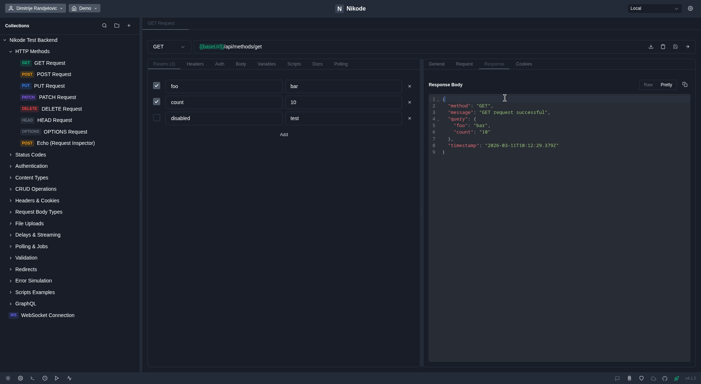

The layout can be switched between **horizontal** (request left, response right) and **vertical** (request top, response bottom) modes using the layout toggle shortcut or status bar button. All panels are resizable via drag handles.

---

## 2. User Account & Workspaces

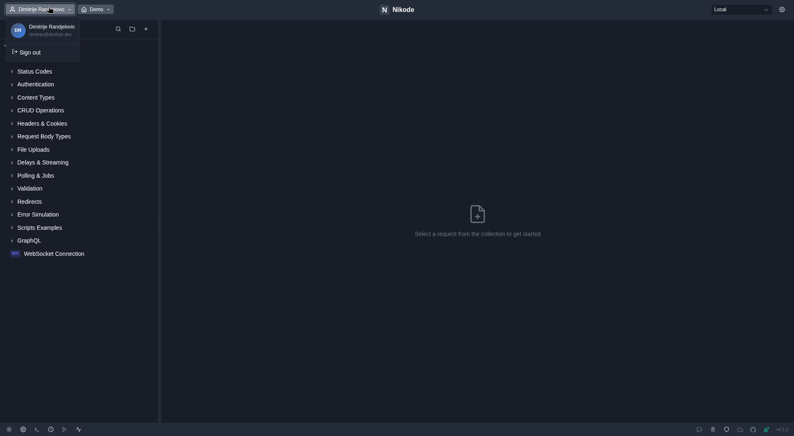

### User Account

Click your username in the **top-left corner** to access account options:

- View your display name and email
- **Sign out** of your account

### Workspaces

The **workspace selector** (next to your username) lets you:

- Switch between workspaces (e.g., "Demo")
- Create, rename, and delete workspaces
- Share workspaces with team members and manage roles
- Manage workspace API keys (owner only)
- Leave shared workspaces

### Environment Selector

The **environment dropdown** in the top-right corner lets you switch between environments (e.g., "Local"). Environments define sets of variables that are substituted into your requests using the `{{variableName}}` syntax.

---

## 3. Collections Sidebar

The left sidebar displays your collections in a tree view with folders and requests.

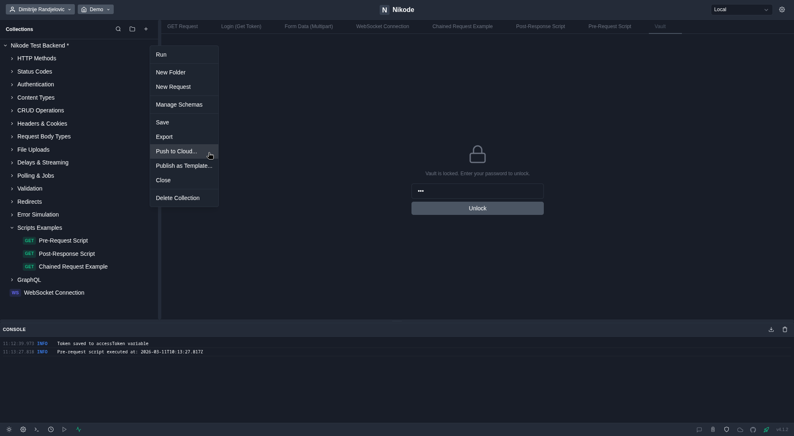

### Collection Management

Right-click a collection name to access:

- **Run** — Open the Collection Runner to batch-execute requests
- **New Folder** — Create a subfolder to organize requests
- **New Request** — Add a new HTTP, WebSocket, or GraphQL request
- **Manage Schemas** — Define JSON/XML schemas for validation
- **Save** — Save the collection to disk
- **Export** — Export in various formats (Nikode, Postman, OpenAPI, cURL)
- **Push to Cloud...** — Sync the collection to your cloud workspace
- **Publish as Template...** — Share the collection as a community template
- **Close** — Close the collection without deleting
- **Delete Collection** — Permanently remove the collection

### Organizing Requests

- **Drag & drop** requests and folders to reorder them
- **Right-click** individual requests to rename, duplicate, delete, or copy as cURL
- Use the **search icon** at the top of the sidebar to filter collections by name
- Click the **folder icon** to open a collection from disk, or the **+** icon to create a new one

### Request Types

Requests are color-coded by HTTP method:
- **GET** (green), **POST** (orange), **PUT** (blue), **PATCH** (yellow), **DELETE** (red), **HEAD** (purple), **OPTIONS** (gray)
- **WS** (teal) for WebSocket connections
- **GQL** (purple) for GraphQL queries and mutations

---

## 4. Request Editor

The request editor is the main workspace for composing and sending HTTP requests.


### URL Bar

- Select the **HTTP method** from the dropdown (GET, POST, PUT, PATCH, DELETE, HEAD, OPTIONS)
- Enter the **request URL** — supports `{{variable}}` substitution (e.g., `{{baseUrl}}/api/methods/get`)
- Click the **Send** button (arrow icon) to execute the request

### Tabs

The editor provides the following tabs:

| Tab | Description |
|-----|-------------|
| **Params** | Query parameters with key-value pairs and enable/disable checkboxes |
| **Headers** | HTTP request headers with enable/disable toggles |
| **Auth** | Authentication configuration (Basic, Bearer, API Key, OAuth 2.0) |
| **Body** | Request body (JSON, Form Data, URL Encoded, Raw, None) |
| **Variables** | Request-level variables for `{{variable}}` substitution |
| **Scripts** | Pre-request and post-response JavaScript scripts |
| **Docs** | Documentation/notes for the request |
| **Polling** | Auto-repeat configuration with interval and max iterations |

### Request Variables

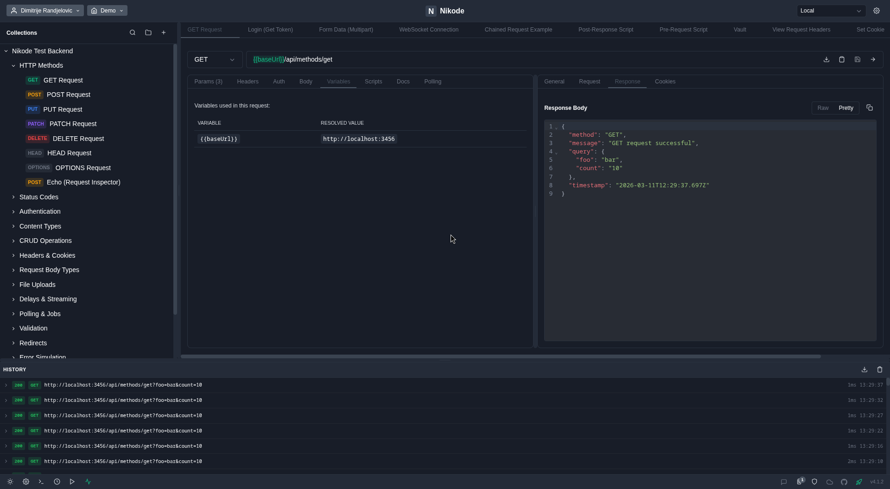

The **Variables** tab lets you define variables scoped to a single request:

- Add key-value pairs that override environment and collection variables
- Variables use the same `{{variableName}}` substitution syntax
- Useful for request-specific values like unique IDs or endpoint-specific tokens

### Request Documentation


The **Docs** tab provides a space to document each request:

- Write plain-text notes describing the request's purpose and usage
- Documentation is saved with the request and visible to team members
- Useful for onboarding, API reference notes, and request-specific instructions

### Query Parameters

The **Params** tab shows a table of query parameters:

- Each row has a **checkbox** to enable/disable the parameter
- Enter the **key** and **value** for each parameter
- Disabled parameters (unchecked) are excluded from the request but preserved for later use
- The tab badge shows the count of active parameters (e.g., "Params (3)")
- Click **Add** to add a new parameter, or the **X** button to remove one

---

## 5. Request Body Types

The **Body** tab supports multiple content types:

### JSON

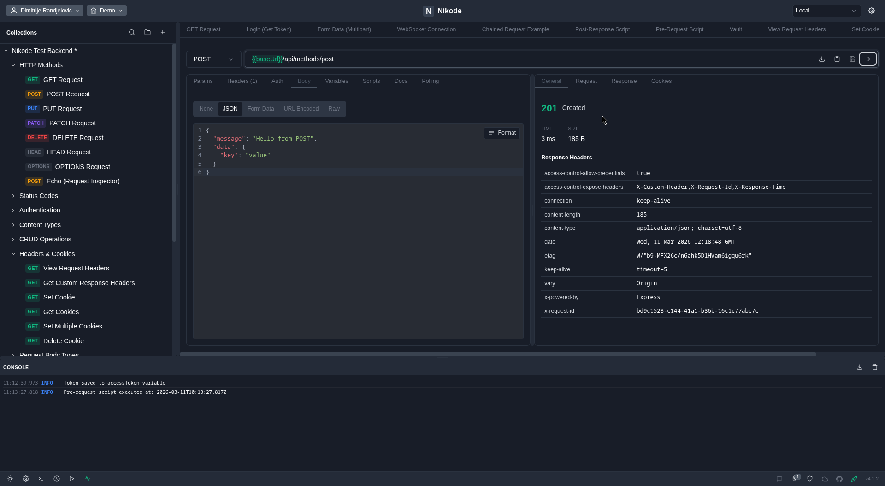

- Write or paste JSON in the code editor with syntax highlighting
- Use the **Format** button to auto-format/prettify the JSON
- Ideal for REST APIs that accept `application/json`

### Form Data (Multipart)

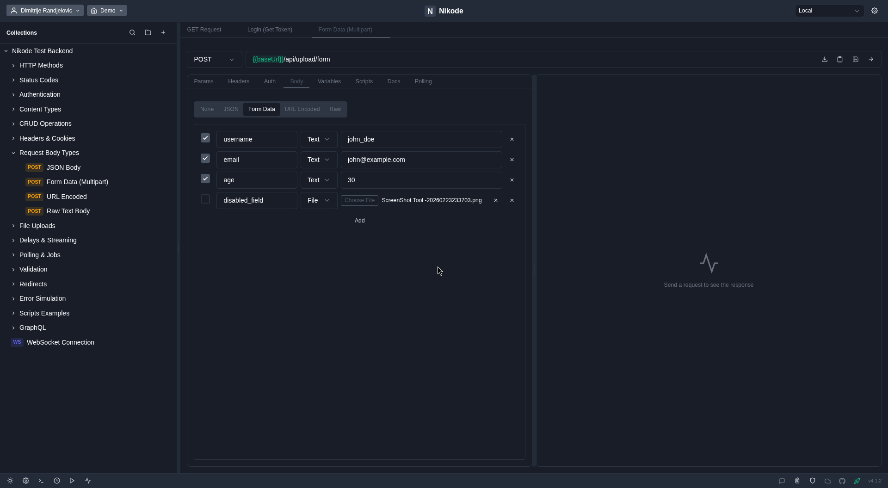

- Add fields with **key**, **type** (Text or File), and **value**
- Each field has an enable/disable checkbox
- For **File** type fields, click **Choose File** to attach a file
- Supports mixed text and file fields in a single request

### URL Encoded
- Key-value pairs sent as `application/x-www-form-urlencoded`
- Same table interface as query parameters

### Raw
- Plain text body with a custom Content-Type header

### None
No request body is sent.

---

## 6. Authentication

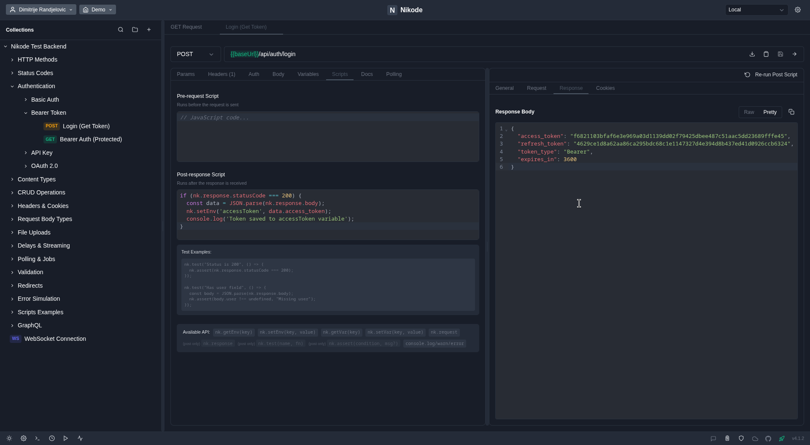

The **Auth** tab supports multiple authentication methods:

### Basic Auth
- Enter **username** and **password**
- Automatically encoded as a Base64 Authorization header

### Bearer Token
- Enter a bearer token directly, or reference a variable (e.g., `{{accessToken}}`)
- Commonly used with JWT tokens obtained from login endpoints

### API Key
- Specify the **key name** and **value**
- Choose whether to send it as a **header** or **query parameter**

### OAuth 2.0
- Configure OAuth 2.0 flows with grant type, token URL, client ID, client secret, and scopes
- Built-in token fetcher to obtain tokens directly from within Nikode

---

## 7. Scripts

Nikode supports JavaScript scripts that run before and after requests, enabling dynamic workflows and automated testing.

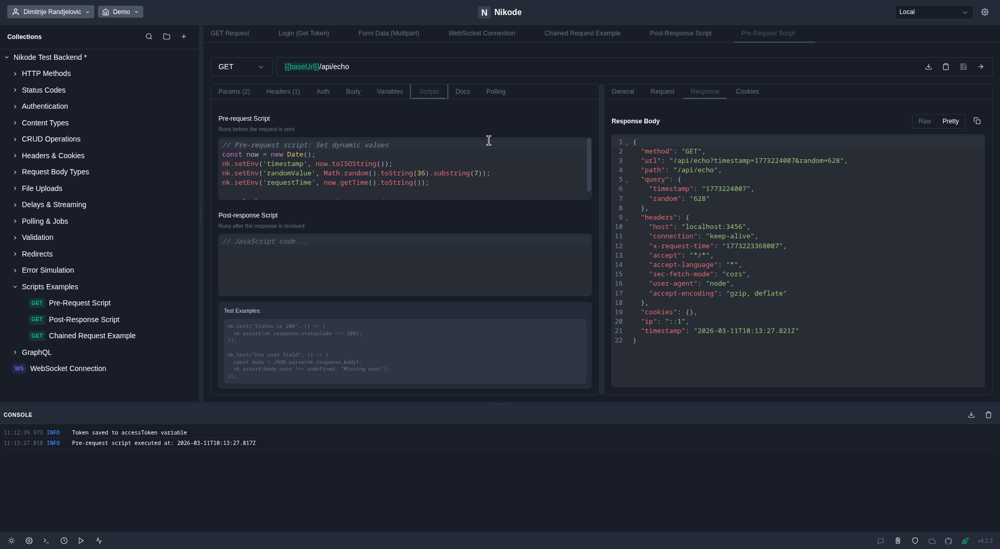

### Pre-Request Scripts

Run **before** the request is sent. Common use cases:

- Set dynamic variables (timestamps, random values)
- Compute authentication signatures
- Chain requests (use tokens from previous responses)

```javascript
// Example: Set a timestamp variable
nk.variables.set("timestamp", new Date().toISOString());
```

### Post-Response Scripts

Run **after** the response is received. Common use cases:

- Extract and store values from responses (e.g., save tokens to variables)
- Validate response data
- Log results to the console

```javascript
// Example: Save a token from the response
if (nk.response.statusCode === 200) {
    let token = nk.response.json().accessToken;
    nk.variables.set("accessToken", token);
    console.log("Token saved to accessToken variable");
}
```

### Test Assertions

Write test assertions in post-response scripts to validate API behavior:

```javascript
// Example: Assert status code
nk.test("Status is 200", nk.response.statusCode === 200);
```

### Chained Requests

Scripts enable powerful request chaining — for example, a login request can save a token that subsequent requests use automatically via `{{accessToken}}`.

---

## 8. Response Viewer

The response viewer appears to the right (or below) the request editor after sending a request.


### Response Tabs

| Tab | Description |
|-----|-------------|
| **General** | Status code, response time, and response size at a glance |
| **Request** | View the actual HTTP request that was sent (headers, body) |
| **Response** | Response body with syntax highlighting (JSON, XML, HTML, etc.) |
| **Cookies** | Cookies returned in the response |

### Response Body

- Toggle between **Raw** and **Pretty** (formatted) views
- Copy the response body to clipboard with the copy icon
- Supports JSON, XML, HTML, images, plain text, and binary/hex views
- Syntax highlighting with line numbers

### Response Headers

The response headers section displays all HTTP headers returned by the server, including:
- CORS headers (`access-control-allow-credentials`, `access-control-expose-headers`)
- Content headers (`content-type`, `content-length`)
- Caching headers (`date`, `expires`)
- Custom headers

### Status Indicators

The response displays:
- **Status code** with color coding (2xx green, 4xx yellow, 5xx red)
- **Response time** in milliseconds
- **Response size** in bytes

---

## 9. Polling

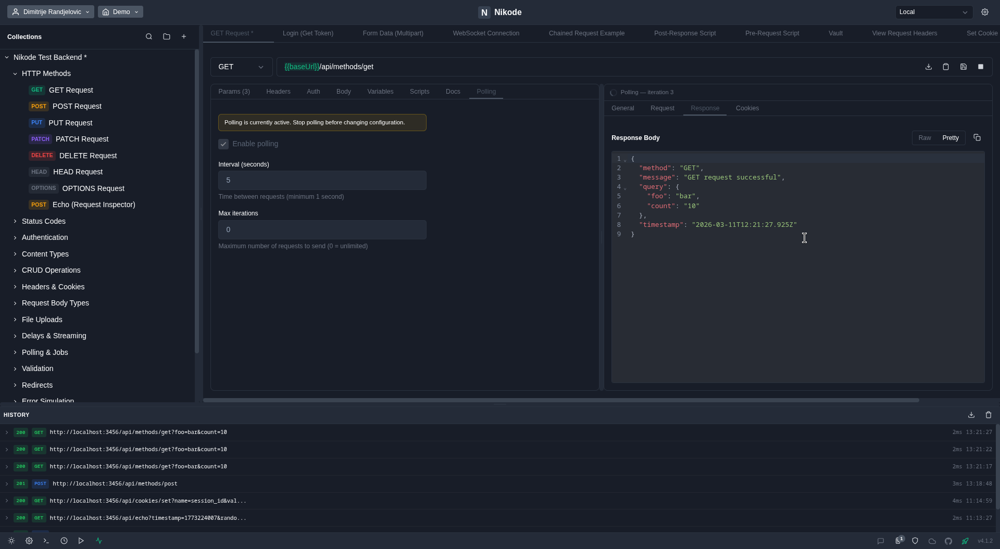

The **Polling** tab lets you automatically repeat a request at regular intervals — useful for monitoring endpoints, waiting for async jobs, or testing rate limits.

### Configuration

| Option | Description |
|--------|-------------|
| **Enable polling** | Toggle polling on/off |
| **Interval (seconds)** | Time between requests (minimum 1 second) |
| **Max iterations** | Maximum number of requests to send (0 = unlimited) |

When polling is active, a warning banner appears: *"Polling is currently active. Stop polling before changing configuration."* — stop polling first to modify settings.

Each polling iteration appears in the History panel, letting you track responses over time.

---

## 10. WebSocket Client

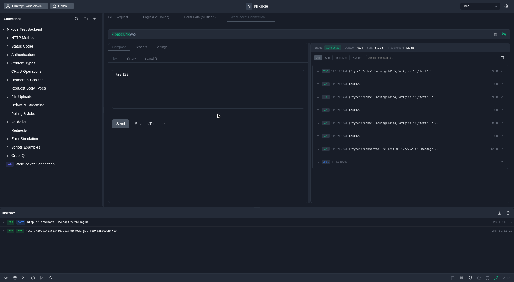

Nikode includes a full-featured WebSocket client for testing real-time connections.

### Connection

- Enter the **WebSocket URL** (supports `{{variable}}` substitution, e.g., `{{baseUrl}}/ws`)
- Click **Connect** to establish the connection
- Connection stats displayed: **Status** (Connected/Disconnected), **Duration**, **Sent** count & bytes, **Received** count & bytes

### Compose Tab

- Write messages in the text area
- Toggle between **Text**, **Binary**, and **Saved** message types
- **Saved** messages let you save frequently-used payloads as templates
- Click **Send** to transmit the message
- **Save as Template** to store the current message for reuse

### Message Log

The right panel shows all messages with:
- **Direction arrows** (sent vs. received)
- **Message type** badges (TEXT, BINARY, OPEN, CLOSE, SYSTEM)
- **Timestamps** for each message
- **Message size** in bytes
- Filter by: **All**, **Sent**, **Received**, **System**
- **Search** messages by content
- Click any message to expand and view full content

### Headers & Settings Tabs

- **Headers** — Set custom headers for the WebSocket handshake
- **Settings** — Configure auto-reconnect, reconnect interval, and subprotocols

---

## 11. GraphQL Editor

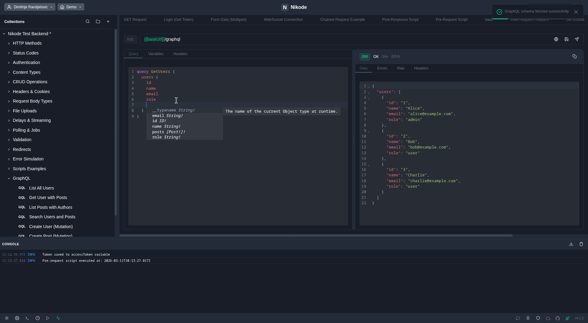

Nikode provides a dedicated GraphQL editor for working with GraphQL APIs.

### Features

- Enter the **GraphQL endpoint URL** (e.g., `{{baseUrl}}/graphql`)
- **Query** tab — Write GraphQL queries and mutations with syntax highlighting
- **Variables** tab — Define JSON variables referenced in your query
- **Headers** tab — Set custom HTTP headers for the request

### Schema Introspection

- Hover over types to see **inline type documentation** (e.g., field types like `String!`, `ID!`, `[Post]!`)
- Schema fetched notification confirms successful introspection ("GraphQL schema fetched successfully")

### Response

- Response body displays the JSON result with syntax highlighting
- Status code, response time, and size shown in the header
- Toggle between **Data**, **Errors**, **Raw**, and **Headers** views

### Sidebar

The GraphQL folder in the collections sidebar organizes your queries:
- **List All Users**, **Get User with Posts**, **List Posts with Authors**, etc.
- **Mutations** like Create User, Create Post
- Each entry is prefixed with the **GQL** badge

---

## 12. Environments & Variables

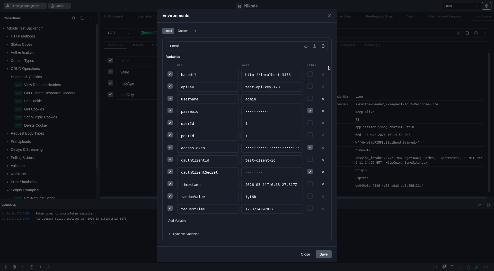

Environments let you define sets of variables that can be swapped for different contexts (development, staging, production).

### Managing Environments

- Use the **environment dropdown** in the top-right to switch environments
- Open the **Environments** dialog to create, edit, and delete environments
- Switch between environments using the tab bar (e.g., "Local", "Demo")
- Each environment contains a table of key-value variable pairs
- Mark variables as **secret** (lock icon) to hide their values in the UI — shown as `••••••••••`
- Click **Add Variable** to add new entries, or the trash icon to remove
- **Dynamic Variables** section at the bottom provides built-in variables

### Common Variables

| Variable | Example Value | Description |
|----------|--------------|-------------|
| `baseUrl` | `http://localhost:3456` | Base URL for API requests |
| `apiKey` | `test-api-key-123` | API authentication key |
| `userId` | `1` | Default user ID |
| `accessToken` | (secret) | Bearer token for auth |
| `oauthClientId` | `test-client-id` | OAuth client identifier |

### Using Variables

Use the `{{variableName}}` syntax anywhere in your requests:
- URL: `{{baseUrl}}/api/users`
- Headers: `Authorization: Bearer {{accessToken}}`
- Body: `{"user": "{{username}}"}`
- Query parameters, auth fields, and scripts

### Variable Scopes

Variables can be defined at multiple levels (higher scopes override lower):
1. **Environment** — Shared across all requests when the environment is active
2. **Collection** — Scoped to a specific collection
3. **Request** — Defined in the request's Variables tab, scoped to that request only
4. **Script-set** — Dynamically set via pre-request or post-response scripts

---

## 13. Console Panel

The console panel appears at the bottom of the screen and shows real-time output from scripts.

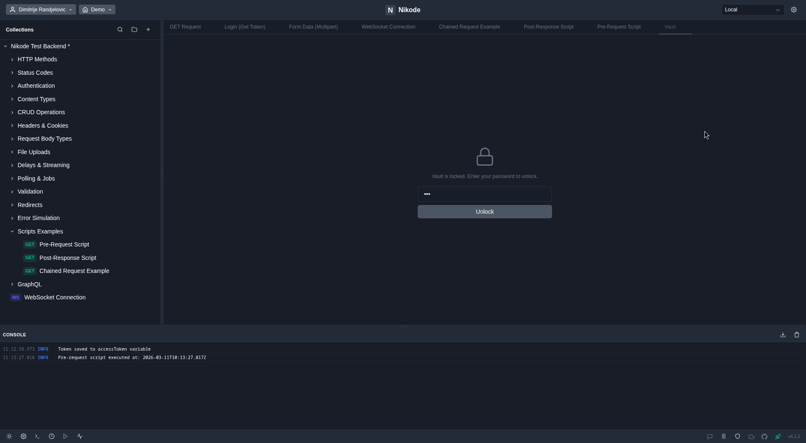

### Features

- Displays **Info**, **Warning**, **Error**, and **Debug** messages with color-coded badges
- Each entry includes a **timestamp**
- Output from `console.log()`, `console.warn()`, `console.error()` in scripts appears here
- System messages (e.g., "Token saved to accessToken variable") also appear here
- **Download** console logs or **Clear** the console with the toolbar buttons
- Toggle visibility from the status bar

---

## 14. History Panel

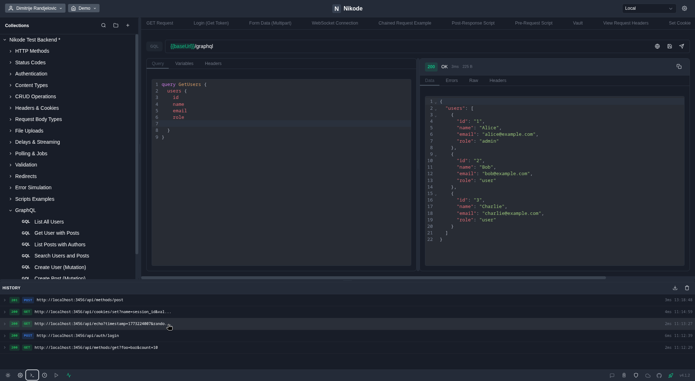

The history panel tracks all requests you've executed during your session.

### Features

- Each entry shows the **status code** (color-coded badge), **HTTP method**, **full URL**, **response time**, and **timestamp**
- Click an entry to expand and view request/response details
- **Download** history or **Clear** it with the toolbar buttons
- Toggle visibility from the status bar
- History persists across tab switches — all requests from the current session are recorded

---

## 15. Collection Runner

The Collection Runner lets you batch-execute multiple requests from a collection.

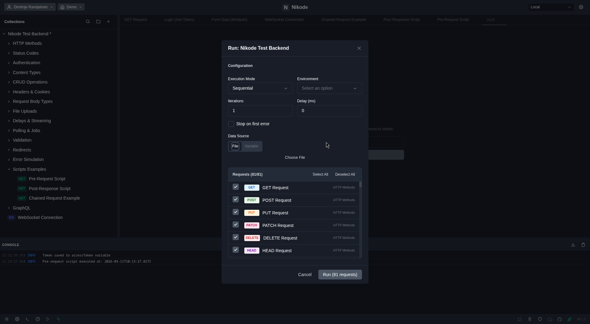

### Configuration

| Option | Description |
|--------|-------------|
| **Execution Mode** | **Sequential** (one at a time) or **Parallel** (concurrent) |
| **Environment** | Select which environment to use during the run |
| **Iterations** | Number of times to run the entire batch (1-1000) |
| **Delay (ms)** | Pause between requests in sequential mode |
| **Stop on first error** | Halt execution if any request fails |

### Data Source

- **File** — Upload a CSV or JSON file for parameterized test runs. Each row/entry drives one iteration with its own variable values.
- **Variable** — Select a collection variable containing an array of data objects. Use a post-script to store an array: `nk.variables.set("data", JSON.stringify([...]))`

### Request Selection

- View all requests in the collection with their HTTP method and parent folder
- **Select All** / **Deselect All** for quick toggling
- Check/uncheck individual requests to include or exclude them
- The **Run** button shows the total count (e.g., "Run (81 requests)")

### Results

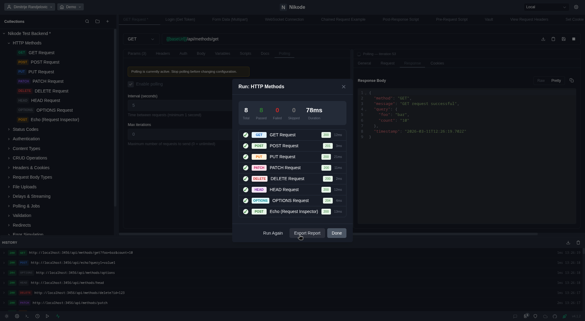

After execution, the runner displays results inline:

- **Pass/fail status** for each request with color-coded checkmarks
- **Total duration** for the entire run
- **Run Again** to re-execute with the same configuration
- **Export Report** to save results as an HTML report
- **Save** results for later reference

### Exported Test Report

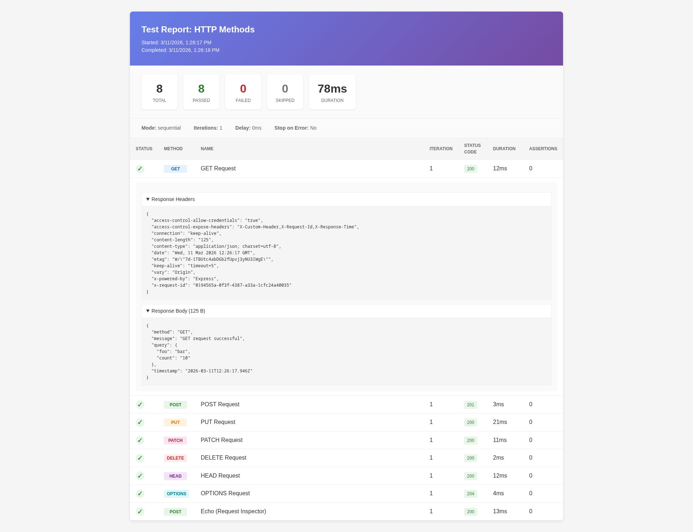

The exported HTML report includes:

- **Summary header** — Total requests, passed, failed, skipped, and total duration
- **Run configuration** — Execution mode, iterations, delay, stop-on-error setting
- **Per-request details** — HTTP method, name, iterations, status code, duration, and assertion count
- **Expandable rows** — Click a request to view response headers and response body
- Shareable as a standalone HTML file

---

## 16. Cookie Jar

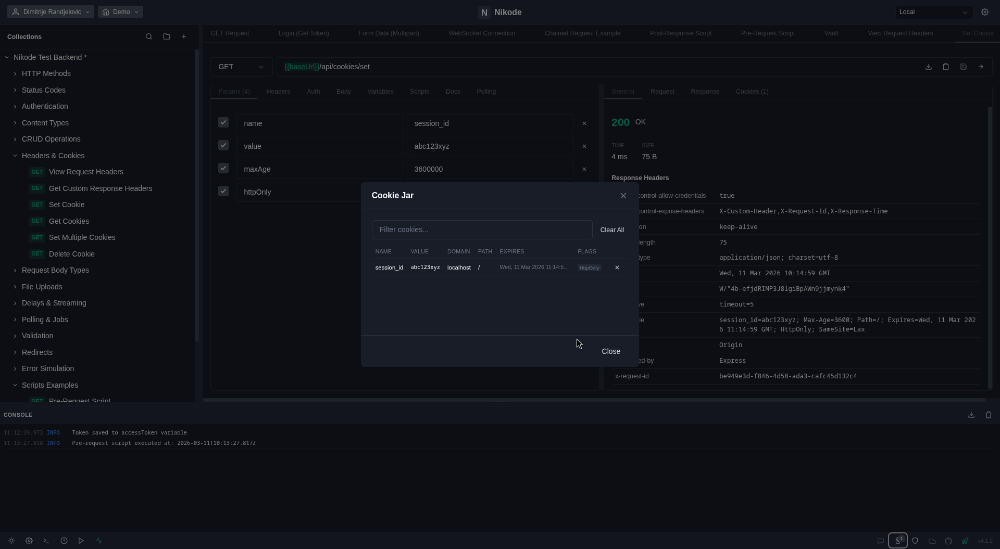

The Cookie Jar manages cookies across your requests within a collection.

### Features

- View all stored cookies in a table: **Name**, **Value**, **Domain**, **Path**, **Expires**, **Flags** (HttpOnly, Secure, etc.)
- **Filter** cookies by name using the search bar
- **Delete** individual cookies with the X button
- **Clear All** cookies at once
- Cookies are automatically captured from responses and sent with subsequent requests to matching domains

---

## 17. Vault (Encrypted Secrets)


The Vault provides encrypted secret storage at the workspace level.

### Unlocking the Vault

Enter your password and click **Unlock** to access stored secrets.

### Managing Secrets

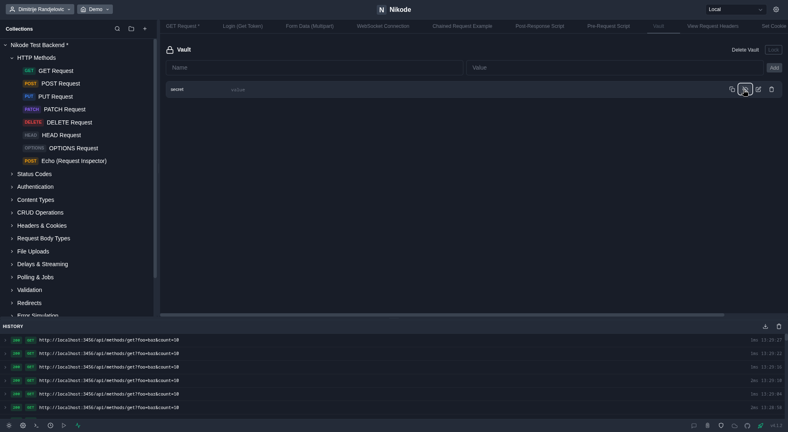

Once unlocked, the vault displays a **Name/Value** table:

- Click **Add** to store a new secret
- Each secret has **copy**, **reveal/hide**, **edit**, and **delete** actions
- Click **Lock** to re-lock the vault when done
- **Delete Vault** removes the vault entirely (owner only)
- Only workspace **owners** can create and manage the vault
- Vault contents are encrypted and never stored in plaintext
- Use vault secrets in your requests via variable references

---

## 18. Webhook Tunnels

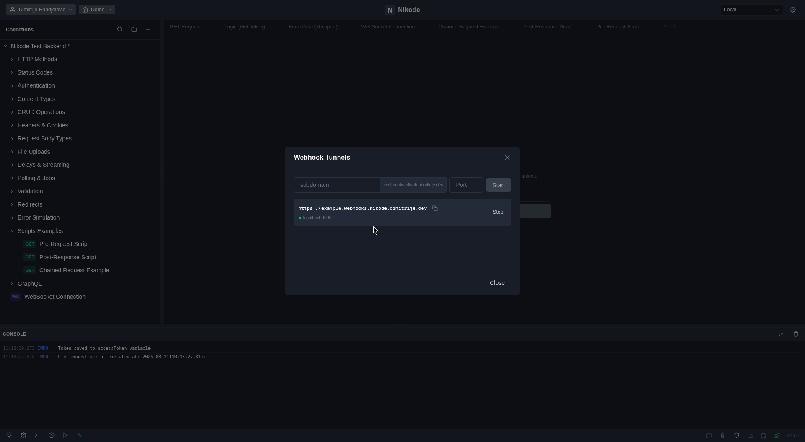

Webhook Tunnels let you expose local servers to the internet for testing webhooks and callbacks.

### Creating a Tunnel

1. Open the Webhook Tunnels dialog from the status bar
2. Enter a **subdomain** (e.g., "example") — this becomes `https://example.webhooks.nikode.dimitrije.dev`
3. Enter the local **port** to forward traffic to (e.g., 3000)
4. Click **Start** to create the tunnel

### Managing Tunnels

- Active tunnels show the **public URL** (with a copy button) and the **local target** (e.g., `localhost:3000`)
- Click **Stop** to disconnect a tunnel
- Click **Close** to dismiss the dialog (tunnels remain active)
- Multiple tunnels can run simultaneously

---

## 19. Schemas

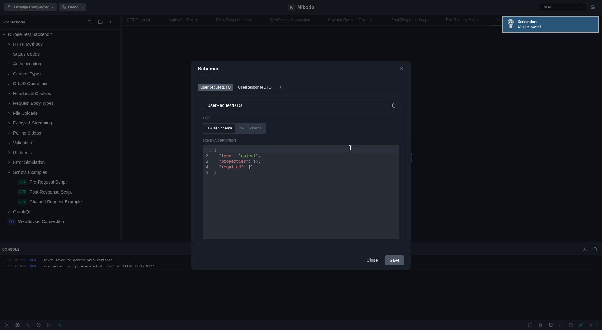

Schemas let you define data structures for validating request and response bodies.

### Features

- Define schemas per collection (e.g., "UserRequestDTO", "UserResponseDTO")
- Switch between **JSON Schema** and **XML Schema** types
- Write schema definitions with syntax highlighting and line numbers
- Schemas can be used for request/response validation
- Add new schemas with the **+** button, delete with the trash icon
- Navigate between schemas using the tab bar

---

## 20. Settings

Access settings via the **gear icon** in the top-right corner or the status bar.

### General Tab

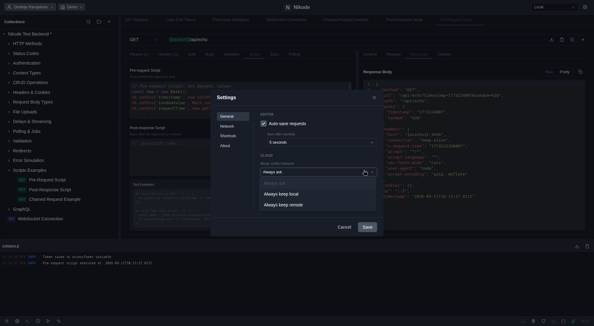

| Setting | Description |
|---------|-------------|
| **Auto-save requests** | Automatically save changes as you edit |
| **Save delay** | Delay in seconds before auto-save triggers |
| **Cloud merge conflict behavior** | Choose how to handle conflicts: Always keep local, Always keep remote |

### Network Tab

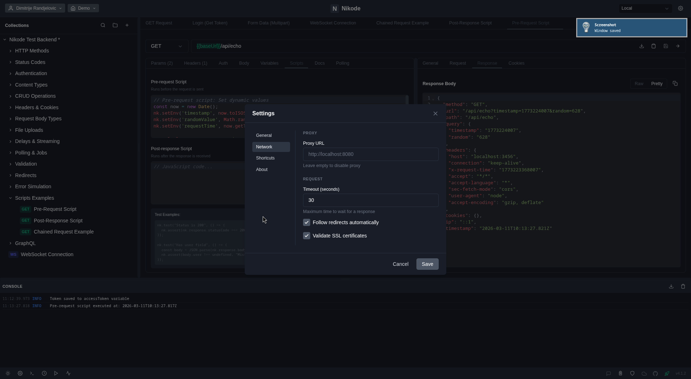

| Setting | Description |
|---------|-------------|
| **Proxy URL** | HTTP proxy for routing requests |
| **Timeout (seconds)** | Request timeout duration |
| **Follow redirects automatically** | Automatically follow HTTP redirects |
| **Validate SSL certificates** | Enable/disable SSL certificate validation |

### Shortcuts Tab

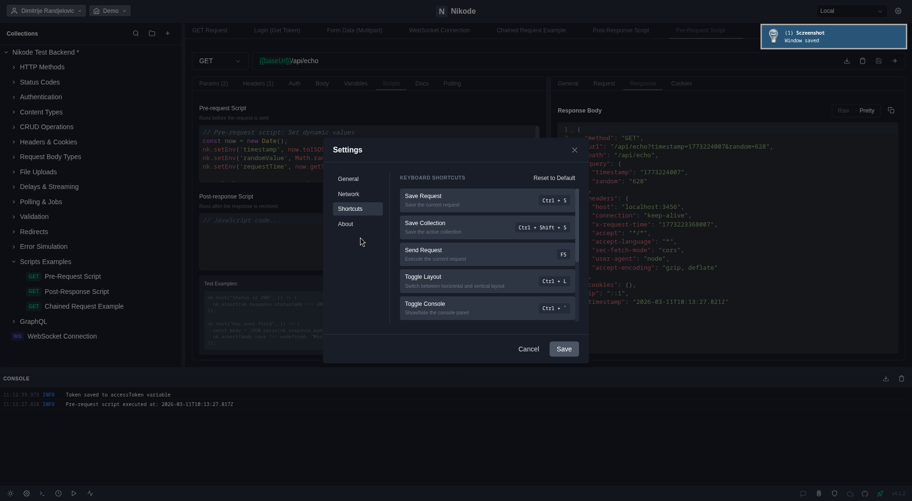

View and customize all keyboard shortcuts. Each action shows its current keybinding and can be reassigned.

### About Tab

Displays version information and links to the GitHub repository.

---

## 21. Import & Export

### Exporting Collections

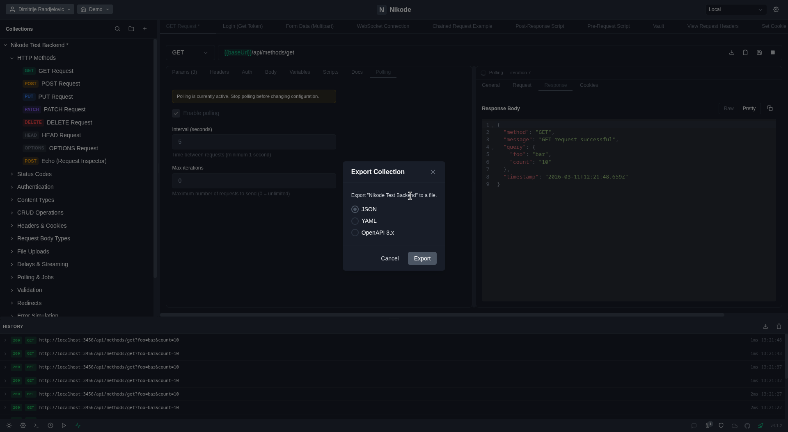

Right-click a collection and select **Export** to save it in one of the following formats:

| Format | Description |
|--------|-------------|
| **JSON** | Native Nikode JSON format preserving all features |
| **YAML** | YAML representation of the collection |
| **OpenAPI 3.x** | Standard OpenAPI/Swagger specification |

Individual requests can also be exported as **cURL** commands via right-click.

### Opening & Importing Collections

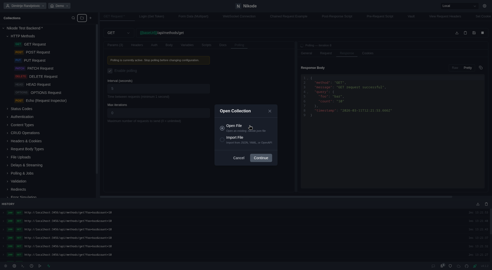

Click the folder icon in the sidebar to open the **Open Collection** dialog:

- **Open File** — Open an existing `.nikode.json` file directly
- **Import File** — Import from JSON, YAML, or OpenAPI formats and convert to a Nikode collection

### Community Templates

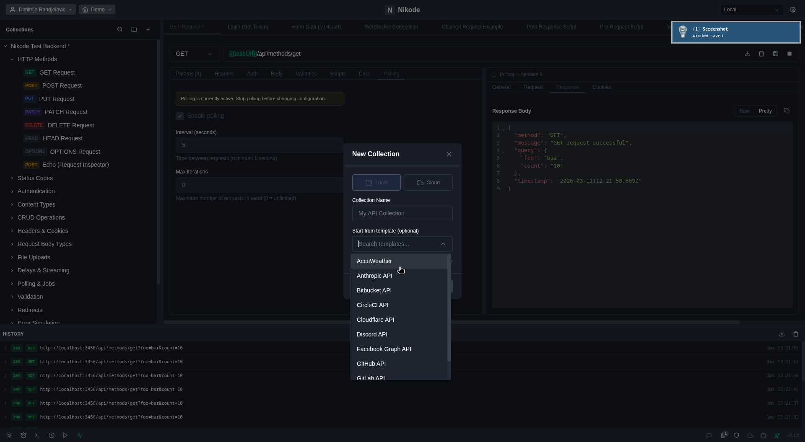

When creating a new collection, you can **seed from a template**:

1. Click the **+** icon in the sidebar
2. Enter a collection name
3. Select **Seed from template (optional)** to browse available templates
4. Choose from community-contributed API templates:
   - Anthropic API, Abstract API, Cloudflare API, Facebook Graph API, GitHub API, and more
5. The collection is pre-populated with example requests for that API

You can also publish your own collections as templates via **Publish as Template** in the collection context menu.

---

## 22. Cloud & Collaboration

### Cloud Sync

- **Push to Cloud** — Upload collections to your cloud workspace
- **Pull from Cloud** — Download the latest version from the cloud
- **Conflict resolution** — Configurable behavior when local and remote versions differ (see Settings > General)

### Real-Time Chat

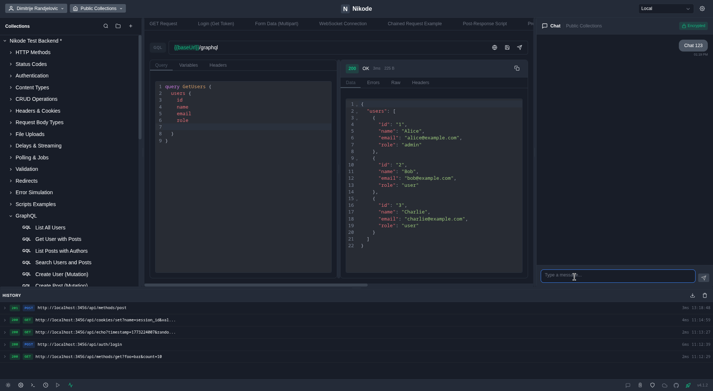

The chat panel provides real-time messaging within a workspace:

- **End-to-end encryption** for all messages
- **Encryption status badges** showing message security
- Accessible from the status bar or sidebar
- Communicate with team members without leaving the app

### Workspace Sharing

- Invite team members with role-based permissions
- Manage members and roles from the workspace settings
- Workspace API keys for CI/CD integration (owner only)

### Authentication

- **SSO login** — Sign in with Single Sign-On
- Cloud-synced workspaces accessible from any device

---

## 23. Keyboard Shortcuts

Default keyboard shortcuts (customizable in Settings > Shortcuts):

| Action | Shortcut |
|--------|----------|
| Save Request | `Ctrl+S` |
| Save Collection | `Ctrl+Shift+S` |
| Send Request | `Ctrl+Enter` |
| Toggle Console | Configurable |
| Toggle History | Configurable |
| Toggle Chat | Configurable |
| Open Settings | Configurable |
| Toggle Dark Mode | Configurable |
| Close Tab | `Ctrl+W` |
| Toggle Layout | Configurable |

---

## 24. UI Features

### Theme

Toggle between **Dark** and **Light** mode using the theme button in the status bar.

| Dark Mode | Light Mode |
|-----------|------------|
|  | 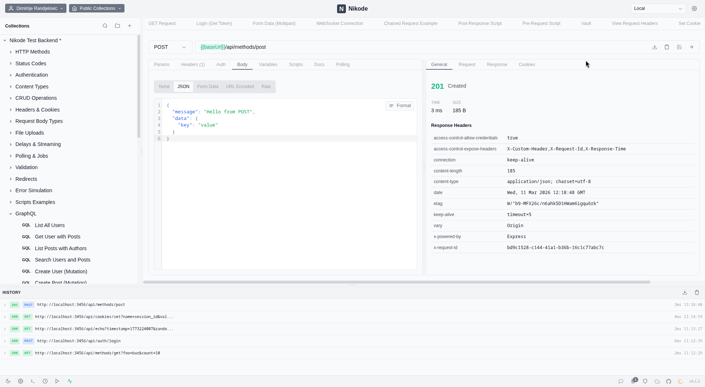 |

### Layout

- **Horizontal layout** — Request editor on the left, response viewer on the right
- **Vertical layout** — Request editor on top, response viewer on the bottom
- Toggle with the layout shortcut or status bar button

### Resizable Panels

All panels (sidebar, editor, response, console, history, chat) are resizable by dragging their borders.

### Tabs

Multiple requests can be open simultaneously as tabs. Click a tab to switch, or use the close button to close it.
